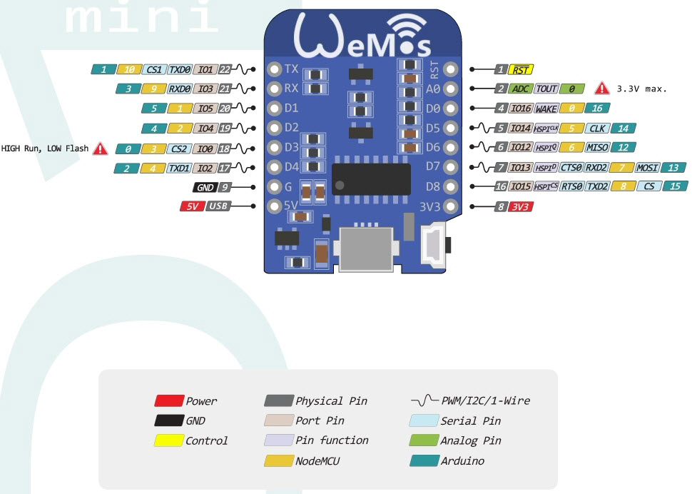
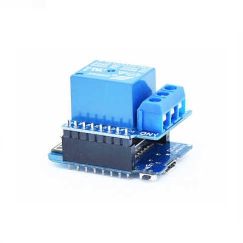

# esp8266-relay-wemos
* ก็็็สืบเนื่องจาก รีโพที่ผ่านมานะคับการทำงานกับไมโครคอนโทรเลอร์ ด้วย ภาษาไพรทรอน และผมก็มีอีกหนึ่งตัวอย่างง่ายๆ 3 บรรทัดจบเลยก็สามารถส่ั่งงาน esp8266 และ relay ได้
แนะนำนะคับ สำหรับคนที่ยังได้อ่าน https://github.com/montri2025/esp8266-micropython-101  
อันนี้ต้องไปก่อน คับ 

 วิธีรันง่ายๆ
  ampy run demo.py 
